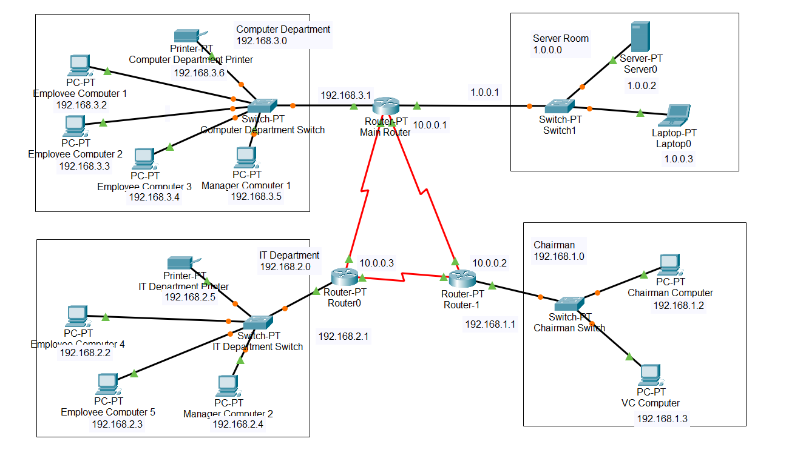

# Small Office High-Availability Network Design

An educational Cisco Packet Tracer topology for a small office with three departmental LANs, a server LAN, and three routers connected in a redundant triangle.

## Repository contents

| Path | Purpose |
|---|---|
| [`packet-tracer/network-design.pkt`](packet-tracer/network-design.pkt) | Editable Cisco Packet Tracer project |
| [`docs/topology.png`](docs/topology.png) | Overview exported from Packet Tracer |
| [`docs/addressing-plan.md`](docs/addressing-plan.md) | Reviewed addressing plan and routing guidance |
| [`docs/validation-checklist.md`](docs/validation-checklist.md) | Tests required to demonstrate connectivity and failover |

## Topology

- **Main Router** connects the Computer Department and server-room LANs.
- **Router0** connects the IT Department LAN.
- **Router1** connects the Chairman LAN.
- The three routers form a triangle, providing an alternate physical path when one inter-router link fails.

Redundant cabling alone does not prove high availability. Dynamic routing, correct point-to-point subnets, and failover tests are also required.

## Addressing review

The screenshot uses private `/24` networks for the three departments. It also shows the server room as `1.0.0.0` and labels the router triangle with `10.0.0.1`, `10.0.0.2`, and `10.0.0.3` without showing separate link subnets or masks.

Before treating the simulation as complete:

1. Move the server room to private address space.
2. Give each point-to-point router link its own `/30` subnet.
3. Configure a dynamic routing protocol such as single-area OSPF.
4. Verify end-to-end connectivity before and after each transit-link failure.

The exact recommended values are in the [addressing plan](docs/addressing-plan.md). These corrections are documented for application in Packet Tracer; the binary has been preserved because device configurations cannot be safely verified from a `.pkt` file outside Cisco Packet Tracer.

## Open and validate

1. Install Cisco Packet Tracer 8.x.
2. Open `packet-tracer/network-design.pkt`.
3. Inspect each router interface, subnet mask, default gateway, and routing table.
4. Apply the reviewed addressing plan.
5. Complete every test in the [validation checklist](docs/validation-checklist.md).
6. Save the updated `.pkt` file and capture routing-table and failover evidence.

## Scope

This repository is suitable for learning and demonstration. It has not been validated for production use, security hardening, capacity planning, or real hardware deployment.

## License

MIT — see [LICENSE](LICENSE).
